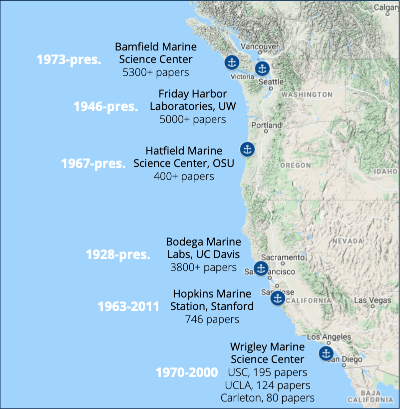

# Data Over Decades
A collaborative project to facilitate discovery and analysis of marine biology student research papers on the North American West Coast

## Overview
Libraries at several academic marine research stations on the West Coast of North America hold large collections of student research reports (Fig. 1). These reports include “unique field observations about environmental conditions, species and populations recorded over a span of nine decades” (Molly Engelbrecht, Bodega Marine Laboratory, UC Davis). Each collection is important within its local context, but taken collectively these papers represent an extremely valuable corpus for conducting historical ecology research. Being able to examine, for example, range shifts in species over such broad spatial and temporal scales is unprecedented in coastal marine ecology. In the context of climate change, the ability to access and analyze this collection becomes even more critical. Some of the subjects covered in the collections include local marine and coastal ecology, community structure, coastal physical and biological oceanography, ecotoxicology, marine invertebrate zoology, invasive species, coastal geology and botany, and freshwater aquatic biology. The collection at UC Davis’ Bodega Marine Laboratory begins in 1928 and is ongoing. Other collections begin later but none of them are any shorter in duration than 40 years of observations. 

## The Challenge

All of these collections are available for in-library use. While it is likely that a large majority of these former students would be happy to have their work made available, the logistical reality of establishing contact with thousands of people is untenable. Since we have not been able to ask explicitly in each case,  we do not have the right to make their work available online. 

It is also true that there is a strong case for making this content available under the doctrine of Fair Use, but many universities are risk averse and tend to avoid even the potential for litigation at the expense of our academic mission. **If we can’t make these materials openly available, how do we at least make these collections maximally discoverable and useful? Can we facilitate exploration and analysis across this corpus without providing direct access to the content?**

## A Place to Start

A conversation with a researcher who has used student papers from Hopkins Marine Station and Friday Harbor Labs in his own research suggested a promising and somewhat obvious first step in making collections of student papers more accessible: we need a catalog of all of the papers. While a functional online catalog is ideal, he said he would be happy to search a spreadsheet (!) with title, author(s), year and location, for all the papers. Further, he indicated that the catalog would be most useful if it included keywords, taxonomic information, specific locations, habitats, and the professor(s) who taught the course. He had not even considered digital access to the papers, but wondered if there was also a way to indicate which of the papers included figures and tables. I asked how useful it would be to have access to the metadata described above and excerpted figures and data, and outside of having full-text access, he indicated that this information would cover the large majority of his anticipated research and teaching needs with the collection. This Shiny App is our first step toward surfacing these extremely valuable collections. 

